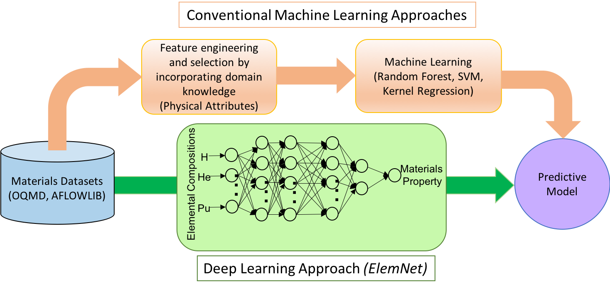
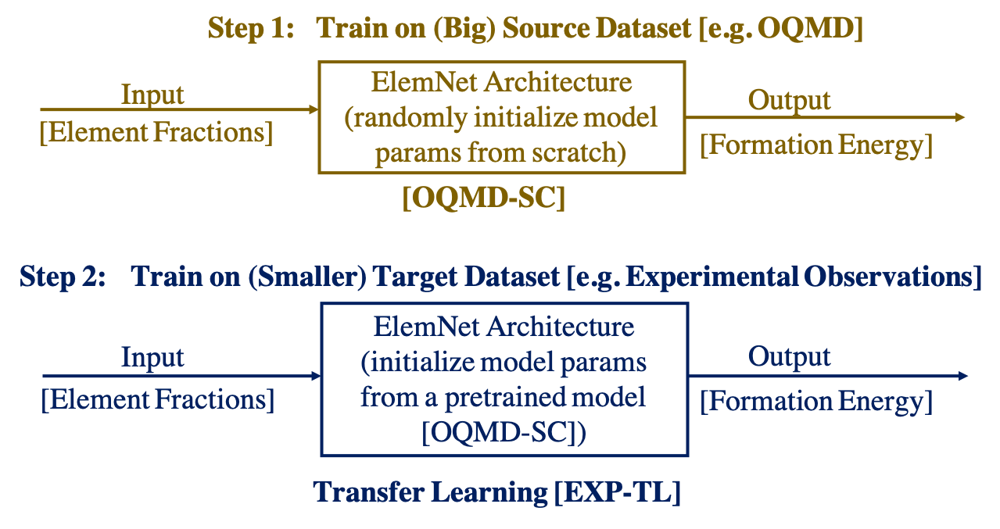

# ElemNet

ElemNet is a deep neural network model that takes only the elemental compositions as inputs and leverages artificial intelligence to automatically capture the essential chemistry to predict materials properties. ElemNet can automatically learn the chemical interactions and similarities between different elements which allows it to even predict the phase diagrams of chemical systems absent from the training dataset more accurately than the conventional machine learning models based on physical attributes levaraging domain knowledge.

  

This repository contains the code for performing data processing, model training and analysis along with the trained model. If you have a large dataset such as OQMD, the model should be trained from scratch. Otherwise for smaller DFT-computed or experimental datasets, it is best to train the model using trasfer learning from a pretrained model as shown below.

  

## Contents

The deep learning model produced in this work is available in the [`elemnet` folder](./elemnet).

The other folders contain scripts associted with different analyses performed to characterize ElemNet. Each folder contains a README file that describes what the analyses are, and the notebooks should be self-describing.

## Installation Requirements

As this git repository uses submodules, you need to clone it with `git clone --recursive` to gather all of the required source code. 

The basic requirement for re-using these environments are a Python 3 Jupyter environment with the packages listed in `requirements.txt`. 

Some analyses required the use of [Magpie](https://bitbucket.org/wolverton/magpie), which requires Java JDK 1.7 or greater. 
See [the Magpie documentation for details]

## Citation

1. D. Jha, L. Ward, A. Paul, W.-keng Liao, A. Choudhary, C. Wolverton, and A. Agrawal, “ElemNet: Deep Learning the Chemistry of Materials From Only Elemental Composition,” Scientific Reports, 8, Article number: 17593 (2018) [DOI:10.1038/s41598-018-35934-y]  [<a href="https://www.nature.com/articles/s41598-018-35934-y">PDF</a>].

2. D. Jha, K. Choudhary, F. Tavazza, W.-keng Liao, A. Choudhary, C. Campbell, A. Agrawal, "Enhancing materials property prediction by leveraging computational and experimental data using deep transfer learning," Nature Communications, 10, Article number: 5316 (2019) [DOI: https:10.1038/s41467-019-13297-w] [<a href="https://www.nature.com/articles/s41467-019-13297-w">PDF</a>].

* Extra files:
  + [evaluate-predictions/dl_best.pkl.gz](http://cucis.ece.northwestern.edu/projects/DataSets/ElemNet/evaluate-predictions/dl_best.pkl.gz) (24 MB).

## Questions/Comments

email: dipendra.jha@eecs.northwestern.edu or ankitag@eecs.northwestern.edue 
Copyright (C) 2019, Northwestern University. 
See COPYRIGHT notice in top-level directory.

## Funding Support

This work was performed under the following financial assistance award 70NANB14H012 and 70NANB19H005 from U.S. Department of Commerce, National Institute of Standards and Technology as part of the Center for Hierarchical Materials Design (CHiMaD). Partial support is also acknowledged from DOE awards DE-SC0014330, DE-SC0019358.
